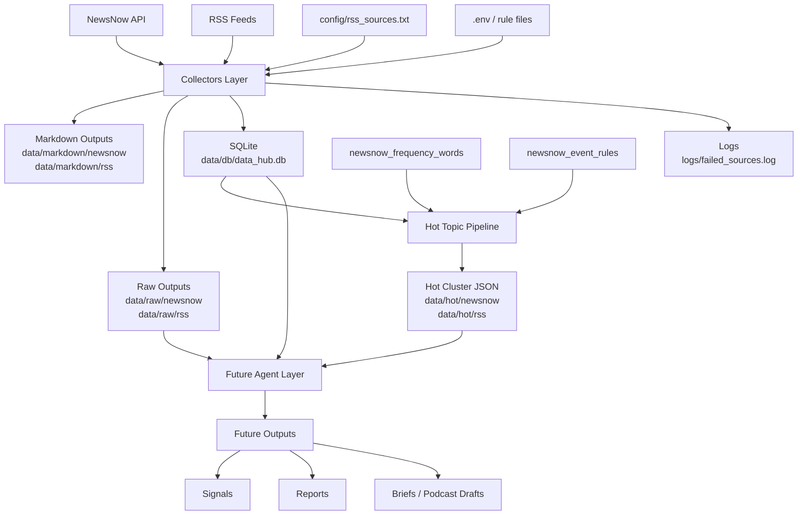

# hourly_hot_collector

`hourly_hot_collector` 是一个面向热点采集与热点发现的 Python 单仓库项目，当前已经具备：
- NewsNow + RSS 双采集
- Markdown 快照输出
- Raw JSON 落盘
- SQLite 结构化存储
- 热点聚类与热度排序
- 为后续 Agent / RAG / 专家分析层预留架构空间

## 项目当前能力

### 1. 数据采集层
- 按小时抓取 NewsNow 热榜快照
- 抓取 RSS 增量新闻
- 将结果写入 Markdown、Raw JSON、SQLite
- 记录失败源日志

### 2. 数据存储层
- 使用 SQLite 作为轻量数据库
- 存储 `fetch_runs` 与 `news_items`
- 为后续去重、事件跟踪、Agent 分析打基础

### 3. 热点发现层
- 直接从 SQLite 读取数据
- 进行时间窗口过滤
- 进行轻量去重
- 分别对 `newsnow` 和 `rss` 做聚类
- 输出热点簇 JSON

### 4. NewsNow 质量控制
- 外部 `frequency_words` 规则过滤
- 外部 `news_event_score` 规则过滤
- 更适合从平台热榜中提取“更像新闻事件”的标题

## 当前目录结构

```text
hourly_hot_collector/
├─ app/
├─ config/
├─ data/
├─ docs/
├─ logs/
├─ scripts/
├─ tests/
├─ hourly_hot_collector.py
├─ hot_topic_pipeline.py
├─ db.py
└─ requirements.txt
```

关键目录说明：
- `app/`：正在逐步沉淀为正式模块结构
- `config/`：运行配置、规则文件、示例 env
- `data/db/`：SQLite 数据库
- `data/raw/`：原始 JSON 数据
- `data/markdown/`：Markdown 输出
- `data/hot/`：热点发现输出
- `logs/`：运行日志与失败日志
- `docs/`：架构、数据流、输入输出与发布规则文档

## 配置文件

主要配置来自项目根目录的 `.env`。

当前常用配置文件包括：
- `config/rss_sources.txt`
- `config/newsnow_frequency_words.txt`
- `config/newsnow_event_rules.txt`
- `config/collector.example.env`
- `config/pipeline.example.env`

## 安装依赖

```bash
python -m venv .venv
.venv\Scripts\activate
pip install -r requirements.txt
```

## 快速开始

### 1. 准备配置

复制并填写你自己的运行配置：

```bash
copy config\collector.example.env .env
```

重点确认这些路径和参数：
- `NEWSNOW_BASE_URL`
- `RSS_DATABASE_FILE`
- `DB_FILE`
- `RUN_MINUTE`
- `TIMEZONE`

如果你已经有自己的 `.env`，也可以直接沿用。

### 2. 准备 RSS 源

编辑：

```text
config/rss_sources.txt
```

当前格式示例：

```python
RSS_SOURCES = [
    ("Ars Technica", "https://feeds.arstechnica.com/arstechnica/index"),
    ("Reuters World", "https://feeds.reuters.com/Reuters/worldNews"),
]
```

### 3. 初始化依赖

```bash
python -m venv .venv
.venv\Scripts\activate
pip install -r requirements.txt
```

### 4. 运行采集器

```bash
python hourly_hot_collector.py
```

执行后会得到：
- SQLite 数据库：`data/db/data_hub.db`
- NewsNow Markdown：`data/markdown/newsnow/`
- RSS Markdown：`data/markdown/rss/`
- Raw JSON：`data/raw/newsnow/`、`data/raw/rss/`
- 失败日志：`logs/failed_sources.log`

### 5. 运行热点发现

```bash
python hot_topic_pipeline.py
```

执行后会得到：
- `data/hot/newsnow/*.json`
- `data/hot/rss/*.json`

### 6. Docker 方式运行

如果你更希望用容器运行：

```bash
docker-compose up --build
```

## 系统架构图



## 运行采集器

```bash
python hourly_hot_collector.py
```

采集器运行后会写入：
- `data/markdown/newsnow/`
- `data/markdown/rss/`
- `data/raw/newsnow/`
- `data/raw/rss/`
- `data/db/data_hub.db`
- `logs/failed_sources.log`

## 运行热点发现 Pipeline

```bash
python hot_topic_pipeline.py
```

运行后会输出到：
- `data/hot/newsnow/`
- `data/hot/rss/`

## 也可以使用脚本入口

```bash
python scripts/run_collector.py
python scripts/run_hot_pipeline.py
```

## 当前架构状态

为了兼容现有运行方式，项目目前保留了根目录入口：
- `hourly_hot_collector.py`
- `hot_topic_pipeline.py`
- `db.py`

同时核心逻辑正在逐步迁移到：
- `app/collectors/`
- `app/pipelines/`
- `app/storage/`

未来预留的层包括：
- `app/agents/`
- `app/rag/`
- `app/schemas/`
- `app/utils/`

## 当前开发路线图

### 已完成
- NewsNow + RSS 双采集
- Markdown / Raw JSON / SQLite 三层落盘
- `fetch_runs` / `news_items` 结构化入库
- RSS 增量窗口修复
- Hot Topic Pipeline 从 SQLite 读取
- `newsnow` / `rss` 分开聚类
- NewsNow 外部规则过滤
- NewsNow `news_event_score` 规则层
- 项目目录第一阶段、第二阶段重构

### 当前进行中
- 将根目录脚本逐步迁入 `app/` 模块
- 把 pipeline 内部逻辑继续拆到 `dedup / clustering / quality_filters`
- 给 collector 与 pipeline 增加更真实的测试
- 持续优化 NewsNow 热点簇质量

### 下一阶段
- 建立 `app/agents/` 的真实分析实现
- 建立 `app/rag/` 的检索上下文层
- 增加主题解释、信号评分、场景分析
- 输出结构化分析结果到 `data/analysis/`

### 更后续的方向
- Telegram / 播客 / Dashboard 分发层
- 历史热点对比
- 主题演化追踪
- 更稳定的版本发布与自动化流程

## 相关文档

- [架构说明](docs/ARCHITECTURE.md)
- [数据流说明](docs/DATA_FLOW.md)
- [Agent 规划](docs/AGENTS.md)
- [输入输出规范](docs/IO_SPEC.md)
- [Release / Tag 规则](docs/RELEASE.md)

## Release / Tag 规则

当前采用轻量语义化版本规则：
- `v0.1.0`
- `v0.2.0`
- `v1.0.0`

版本含义：
- `PATCH`：小修复、小调整
- `MINOR`：新功能、非破坏升级
- `MAJOR`：破坏性变更或运行方式调整

详细规则见：
[docs/RELEASE.md](docs/RELEASE.md)

## 项目定位

这个项目当前不是一个“大而全”的新闻平台，而是一个：

1. 可持续运行的热点采集系统  
2. 可持续演进的热点发现系统  
3. 为未来多专家 Agent / RAG 分析层准备的基础设施

当前阶段重点是：
- 保持采集稳定
- 保持热点发现质量
- 逐步整理工程结构
- 为后续分析层提供干净的数据接口
